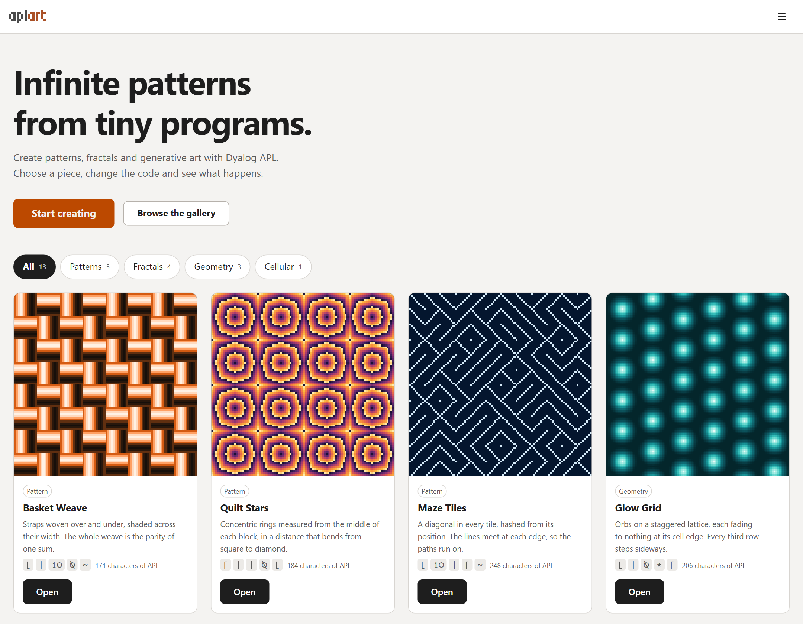
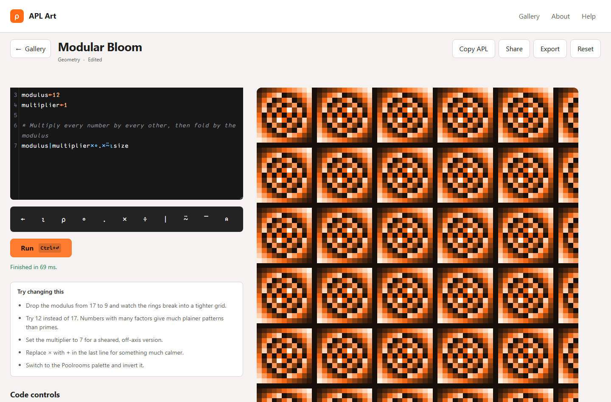

# APL Art

**Tiny programs. Infinite patterns.**

Create patterns, fractals and generative art with Dyalog APL. Choose a piece, change the code and see
what happens.

Live site: <https://dragnim.github.io/aplart/>

Every picture is drawn from numbers returned by actually running the APL shown in the editor. Nothing
is simulated in JavaScript.



Open a piece and the code is right there beside it. Move a slider and the matching number in the APL
changes with it.



---

## Contents

- [Local setup](#local-setup)
- [Development commands](#development-commands)
- [Environment configuration](#environment-configuration)
- [Matrix output contract](#matrix-output-contract)
- [TryAPL integration notes](#tryapl-integration-notes)
- [CORS troubleshooting](#cors-troubleshooting)
- [Adding a new artwork preset](#adding-a-new-artwork-preset)
- [APL font](#apl-font)
- [Accessibility](#accessibility)
- [Deployment](#deployment)
- [Testing](#testing)
- [Roadmap](#roadmap)
- [Licence](#licence)

---

## Local setup

Requires **Node 22**, not merely Node 22 or later.

The version matters more than it usually does. Node 24 builds this project
perfectly well, but it does not build it _identically_: the same commit produces
a different JavaScript bundle hash under 22 and 24, which makes "is the deployed
site the current commit?" impossible to answer by comparing build output. CI and
the Pages deploy both use 22, so local should too. `.nvmrc` says so, and
`engines` now refuses anything newer rather than waving it through.

```bash
git clone https://github.com/dragnim/aplart.git
cd aplart
nvm use        # reads .nvmrc; CI reads the same file
npm install
npm run dev
```

The dev server serves the app at <http://localhost:5173/aplart/>. The `/aplart/` prefix is deliberate:
it matches the GitHub Pages base path, so local development and production resolve assets identically.

No API keys, accounts or secrets are needed.

## Development commands

| Command                     | What it does                                                       |
| --------------------------- | ------------------------------------------------------------------ |
| `npm run dev`               | Start the development server with hot reloading.                   |
| `npm run build`             | Typecheck, then build the static site into `dist/`.                |
| `npm run preview`           | Serve the built site locally, exactly as Pages will.               |
| `npm run typecheck`         | Run TypeScript with no emit.                                       |
| `npm run lint`              | Run ESLint over the whole repository.                              |
| `npm run lint:fix`          | Run ESLint and apply the fixes it can make safely.                 |
| `npm run format`            | Format everything with Prettier.                                   |
| `npm run format:check`      | Fail if anything is unformatted — this is what CI runs.            |
| `npm test`                  | Run unit and component tests once.                                 |
| `npm run test:watch`        | Run those tests in watch mode.                                     |
| `npm run test:live`         | Run the suite that calls the **real** TryAPL endpoint (see below). |
| `npm run test:e2e`          | Build, preview and run the Playwright journeys.                    |
| `npm run validate:presets`  | Validate every preset and fail if any is malformed.                |
| `npm run verify:cors`       | Check that the **deployed** site can reach the APL endpoint.       |
| `npm run verify:deployment` | Check the **deployed** site against the production-only criteria.  |

Asset and authoring tools:

| Command                                                    | What it does                                                                 |
| ---------------------------------------------------------- | ---------------------------------------------------------------------------- |
| `npm run refresh:fixtures`                                 | Re-run every preset against the live service and rewrite its fixture.        |
| `npm run generate:thumbnails`                              | Render gallery thumbnails from the committed fixtures. No network.           |
| `npm run preset:variants -- <preset> <variable> <values…>` | Render one preset at several settings into a montage, for choosing defaults. |
| `npm run preset:sheet`                                     | Render every preset's fixture into one contact sheet.                        |
| `npm run preset:debug -- <preset> [variable] [value]`      | Run one preset and print the generated expression and the raw reply.         |
| `npm run screenshot`                                       | Drive the built site in a real browser and capture screenshots.              |

`refresh:fixtures` and `generate:thumbnails` are deliberately separate steps, and neither runs during
a build. A build that silently refreshed fixtures would destroy the thing they exist for: noticing
when a preset's output changes without anyone meaning it to.

The preset tools are namespaced under `preset:` for a reason. An earlier version of this project named
the variants tool `preview`, which silently replaced Vite's own `preview` script — the one the
end-to-end tests use to serve the built site. Local runs kept passing because Playwright was reusing a
preview server that had been left running by hand, so only CI noticed. `reuseExistingServer` is now
off, so a broken server command fails locally too.

`npm run test:live` is deliberately excluded from `npm test` and from the required CI checks. It calls
a shared public service, and a pull request must not fail because that service is momentarily busy.

## Environment configuration

Copy `.env.example` to `.env.local` and edit as needed. Every value has a working default, so the file
is optional.

| Variable                       | Default                   | Purpose                                       |
| ------------------------------ | ------------------------- | --------------------------------------------- |
| `VITE_APL_EXEC_ENDPOINT`       | `https://tryapl.org/Exec` | Where APL is executed.                        |
| `VITE_APL_REQUEST_TIMEOUT_MS`  | `8000`                    | Client-side timeout for a whole execution.    |
| `VITE_MAX_MATRIX_ROWS`         | `256`                     | Hard ceiling on rendered rows.                |
| `VITE_MAX_MATRIX_COLUMNS`      | `256`                     | Hard ceiling on rendered columns.             |
| `VITE_MAX_MATRIX_CELLS`        | `65536`                   | Hard ceiling on total cells.                  |
| `VITE_SINGLE_REQUEST_MAX_ROWS` | `90`                      | Rows obtainable from one TryAPL request.      |
| `VITE_MAX_CODE_LENGTH`         | `10000`                   | Maximum submitted code length, in characters. |
| `VITE_MAX_RESPONSE_BYTES`      | `2097152`                 | Reject raw responses larger than this.        |
| `VITE_BASE`                    | `/aplart/`                | Deployment base path.                         |

All of these are read in exactly one place, [`src/app/config.ts`](src/app/config.ts). Nothing else in
the codebase touches `import.meta.env`. Values that are missing or malformed fall back to the default
with a console warning rather than propagating `NaN` through the application.

## Matrix output contract

Every artwork program must return a **rectangular numeric matrix**. The renderer maps each number to a
palette colour; it never receives markup, images or text from APL.

Supported:

- Rank-2 numeric arrays, minimum 2×2.
- Finite integers and floating-point values, including negatives written with the APL overbar (`¯3`).

Rejected, with a friendly message:

- Nested arrays, character arrays, complex numbers.
- Non-rectangular output, infinities, `NaN`.
- Output exceeding the configured size limits.

### Size limits, and why they are what they are

The spec this project was built from assumed a 256×256 default. **TryAPL cannot deliver that in one
request.** Measured against the live endpoint:

| Limit                         | Measured value                     |
| ----------------------------- | ---------------------------------- |
| Maximum lines in a response   | **93**, silently truncated         |
| Maximum characters per line   | **995**, silently truncated        |
| Workspace size                | **512 KB** (`WS FULL`)             |
| `⎕PW`                         | `NOT SUPPORTED` — cannot be raised |
| Workspace state between calls | Not preserved (`CORRUPT WS`)       |

A `256 256⍴⍳7` therefore comes back as 93 rows, with the rest gone and no error to say so. What
follows from that is the shape of every run:

The first request asks for the artwork and, in the same expression, measures what it is about to
print. If the printed form fits strictly inside both caps, that request _is_ the artwork: one request,
one evaluation, exact values. If it does not, the reply is a single marked line of metadata — rank,
depth, `⎕DR`, printed height and width, shape — and the adapter falls back to bands: it re-executes
the code once per band, each returning a different reshaped slice, and stitches the result together.
Values are still exact, nothing is quantised, but the artwork costs one execution per band.

Which of the two happens is decided by the result, never by the preset. There is no flag to set, and
deliberately so: the code in the editor is not the code the preset shipped, so anything declared in
advance would be a statement about a different program. A preset that once had to declare
`outputLimits.highResolution` for its own source made that source unrunnable from anywhere else, and
made every other program unrunnable from it.

The adapter verifies the reassembled cell count against the shape the first request reported. A short
or truncated band is a hard error, never a silently incorrect picture.

### The 512 KB workspace

Response size is not the only ceiling. Each run gets a 512 KB workspace, and a preset that holds
several matrices of doubles at once will exhaust it long before it hits the transfer limits.
Mandelbrot Field is the clearest case: it fails with `WS FULL` somewhere between 160×160 and
176×176, so its resolution is capped at 144.

This is why `tests/live/presets.test.ts` runs every numeric control at its maximum **at the same
time** as well as one at a time. A preset that builds one array per unit of a second parameter — a
wave per direction, a matrix per iteration — only runs out of memory when two controls are high
together, and that is a combination a visitor reaches in seconds.

When authoring a preset, keep the peak number of live arrays in mind, not just the size of the
result.

## TryAPL integration notes

Everything TryAPL-specific lives in `src/execution/TryAplExecutionService.ts`. The rest of the
application talks to the `AplExecutionService` interface and knows nothing about the wire format.

**Request.** `POST` a JSON array to the endpoint:

```json
["", 0, "", "3 3⍴⍳9"]
```

Item 0 is the session state (empty string starts a clean workspace) and item 3 is the expression.

**Response.** A four-item JSON array. Item 3 is an **array of output lines** — not a single string:

```json
["<state blob>", 4834, "<blob>", ["1 2 3", "4 5 6", "7 8 9"]]
```

**Things worth knowing, all verified against the live service:**

- **Errors return HTTP 200.** An APL error arrives as ordinary output lines (`LENGTH ERROR`, the echoed
  source, and a caret). Failure is detected by parsing the output, not by the status code.
- **One expression per request.** Multi-line preset code is flattened into a single expression joined
  with `⋄` before sending. Comments must be stripped first, quote-aware, or a `⍝` would swallow the
  rest of the line.
- **State is not preserved.** Sending a returned state back gives `CORRUPT WS: Workspace was reset`, so
  a variable cannot be assigned in one request and read in the next. Banded transport re-executes
  instead of caching.
- **Complex numbers fail.** A `0J1`-based Mandelbrot returns `DOMAIN ERROR`; use real arithmetic.
- **It is fast.** Typical round trips measured 35–175 ms.

## CORS troubleshooting

TryAPL currently sends `Access-Control-Allow-Origin: *` on both the preflight and the `POST`, so the
browser can call it directly from any origin and **no proxy is required**. This has been confirmed
end to end: a real Chromium page loaded from `https://dragnim.github.io/aplart/` successfully executed
`3 3⍴⍳9` against `https://tryapl.org/Exec` and read the result back.

Re-check it at any time with:

```bash
npm run verify:cors
```

That script loads the deployed site in a real browser and makes the request from that origin, which is
the only way to test this — `curl` will happily read a response the browser would forbid, and testing
from `localhost` proves nothing because the origin is the thing under test.

If that ever changes, the symptom is a browser console error mentioning
`No 'Access-Control-Allow-Origin' header` while `curl` against the same endpoint still succeeds — CORS
is enforced by the browser, not the server. The fix is to either have the required origins permitted on
the backend, or point `VITE_APL_EXEC_ENDPOINT` at a small proxy that adds the headers. Do not attempt
to work around CORS with browser flags or public CORS-anywhere services.

## Adding a new artwork preset

1. **Write the APL** in `src/presets/apl/<preset-id>.apl`. Named parameter assignments at the top, one
   per line, then the expression that returns the matrix:

   ```apl
   ⍝ Controls
   size←64
   modulus←9

   ⍝ Generate the artwork
   modulus|∘.×⍨⍳size
   ```

   There is no row limit to observe and nothing to declare about size: a result that prints comes
   back in one request, and a larger one is fetched in bands. What a preset does need to keep
   honest is its **Resolution** maximum, which is about the 512 KB workspace the program runs in
   rather than about transport — see Julia and Mandelbrot's 144.

   The `.apl` file is the source of truth for the program: it is what the editor shows, what is sent
   to TryAPL, and what a saved project is compared against to decide whether it has been edited. There
   is deliberately no second copy in TypeScript.

2. **Create the module** in `src/presets/`, exporting an `ArtworkPreset`. The type is defined in
   [`src/presets/schema.ts`](src/presets/schema.ts). It holds the metadata — parameters, prose,
   palettes, capabilities — and imports the program rather than restating it:

   ```ts
   import source from './apl/your-preset.apl?raw';
   import { artworkSource } from './artworkSource';

   export const yourPreset: ArtworkPreset = {
     code: artworkSource(source),
     // …
   };
   ```

   `artworkSource` removes the file's single trailing newline and nothing else, so the program is the
   same whether or not an editor re-adds one.

   A script that imports a preset must be run with the `?raw` loader, because `tsx` is esbuild and
   does not understand the suffix that Vite and Vitest do:

   ```json
   "your:script": "tsx --import ./scripts/lib/registerRaw.mjs scripts/your-script.ts"
   ```

3. **Bind the parameters.** Each `ArtworkParameter` names the `variable` it controls. The binder
   rewrites only an anchored, top-level assignment line — `^(\s*size\s*←\s*).*$` — so a variable used
   elsewhere in the expression is never touched. A parameter whose assignment the user deletes is
   marked _detached_ rather than silently rewriting unrelated code.

4. **Register it** in `src/presets/presets.ts`.

5. **Validate and generate assets:**

   ```bash
   npm run validate:presets
   npm run refresh:fixtures -- your-preset-id   # live service; writes the fixture
   npx prettier --write tests/fixtures/your-preset-id.json
   npm run generate:thumbnails                  # from the committed fixture, no network
   ```

   Run Prettier on the fixture afterwards. `refresh:fixtures` writes its JSON with `JSON.stringify`,
   which is not how Prettier would format it, so `format:check` fails on a freshly written fixture and
   the pre-commit gate stops. Formatting it is not cosmetic tidying — the alternative is a gate failure
   at the end of an otherwise finished stage.

`validate:presets` checks the things the compiler cannot: that ranges make sense, that defaults sit
inside them, and — importantly — that every parameter actually has a matching top-level assignment in
the code. A preset that fails validation is dropped from the gallery at runtime and fails the build in
CI.

## APL font

APL glyphs are set in [APL387](https://github.com/Dyalog/APL387), a redrawn successor to Adrian Smith's
APL385 Unicode, released into the public domain under The Unlicence.

The upstream repository does not commit a built font — it is produced by their CI. `scripts/subset-font.py`
downloads the built TTF and subsets it to the Latin, punctuation, arrow, mathematical-operator and
Miscellaneous Technical ranges, taking it from 303 KB to about 23 KB of WOFF2. The result is committed
to `src/assets/fonts/`, so contributors never need to run the script. To pick up an upstream revision:

```bash
pip install "fonttools[woff]" brotli
python scripts/subset-font.py
```

## Accessibility

The target is WCAG 2.2 AA. Specifically:

- Everything is operable by keyboard, with a visible focus indicator and a skip link.
- The canvas carries a text description of the artwork's dimensions and value range; no attempt is made
  to narrate individual cells.
- Execution status is announced through a live region.
- Information is never conveyed by colour alone — the current navigation item, for example, carries
  both a weight change and an underline.
- Touch targets are at least 44×44 CSS pixels.
- Motion respects `prefers-reduced-motion`, which zeroes the transition duration tokens outright.

### How this is checked

Three things, none of which rely on remembering to look:

- **axe-core**, over fifteen page states in `tests/e2e/accessibility.spec.ts`: every route, the
  workspace before and after a run, showing an error, with the reset dialog open, and each tab of the
  narrow layout. Currently zero violations against `wcag2a` through `wcag22aa`.
- **Contrast, arithmetically**, in `tests/unit/contrast.test.ts`. Ratios are computed from the WCAG
  formula and the colours are read out of `tokens.css`, so changing a token either keeps the contrast
  or fails the build. This covers the editor's syntax colours too, including the active-line tint.
- **Behaviour that axe cannot see**, in the journeys: completing the whole flow by keyboard alone, the
  canvas description, the announced status region, and reduced motion actually taking effect.

Automated checks catch perhaps a third of real accessibility problems, so this is a floor rather than a
claim of compliance. Two known limits worth stating plainly: nothing here has been tested with an
actual screen reader, and the artwork itself is only ever described structurally — its dimensions,
value range and palette — because describing what a generative image _looks like_ is not something this
application can honestly do.

## Deployment

Pushing to `main` triggers `.github/workflows/deploy-pages.yml`, which typechecks, lints, validates
presets, tests, builds and deploys to GitHub Pages using the official actions.

The base path is not hard-coded. `actions/configure-pages` reports the published base path and it is
passed to the build as `VITE_BASE`, so renaming the repository or moving to a custom domain needs no
code change.

Repository settings must have **Settings → Pages → Source** set to **GitHub Actions**. Note that Pages
does not publish from a private repository on GitHub Free.

`.github/workflows/ci.yml` runs the same checks plus the Playwright journeys on pull requests, without
deploying.

## Testing

| Suite              | Command                     | What it covers                                                                       |
| ------------------ | --------------------------- | ------------------------------------------------------------------------------------ |
| Unit and component | `npm test`                  | Parsing, transport planning, colour mapping, parameter binding, sharing, storage.    |
| End-to-end         | `npm run test:e2e`          | Full journeys in Chromium and WebKit, plus the accessibility audit.                  |
| Live service       | `npm run test:live`         | Every preset against the real TryAPL endpoint, at its defaults and its range limits. |
| Deployed site      | `npm run verify:cors`       | That the published origin can actually reach the APL endpoint.                       |
| Deployed site      | `npm run verify:deployment` | The things only production can show — see below.                                     |

`verify:deployment` covers what no test suite can, because it depends on the real deployment: assets
resolving under a subdirectory, a hash route surviving a cold direct visit with no server rewrites, the
committed thumbnails actually being published, and a real browser at the real origin being allowed to
reach TryAPL and draw a picture from what comes back. It exercises the banded high-resolution preset
too, since that is the path most likely to break somewhere other than a developer's machine.

The end-to-end tests stub TryAPL **at the network boundary** rather than substituting a mock service, so
the real `TryAplExecutionService` — wire format, error detection, banding and all — is still the thing
under test. `MockAplExecutionService` exists for the component tests, where there is no network to
intercept.

Only the first two run in required CI. The live suite calls a shared public service, and a pull request
must not fail because that service is momentarily busy.

## Roadmap

**Done:** execution engine with two-tier transport; CodeMirror 6 APL editor with symbol toolbar and APL
syntax highlighting; seven presets; parameter binding with detached-control handling; eight palettes and
the render options; PNG export; share links; local saving; responsive layouts; the accessibility work
above; GitHub Pages deployment.

**Later:** animated matrices, coordinate and path rendering, SVG export, user-defined palettes,
step-through of intermediate arrays, embeddable artworks.

Accounts, cloud projects and a public community gallery are deliberately out of scope, but the storage
layer sits behind a `ProjectRepository` interface and the renderer behind a single matrix contract, so
neither is closed off.

## Licence

MIT — see [LICENSE](LICENSE).

APL Art is an independent project. It writes and runs Dyalog APL, and depends on the TryAPL service and the
APL387 font, both used with thanks.

Interaction ideas for the Mandelbrot explorer were inspired by
[Brian Becker's Mandelbrot explorer](https://bpbecker.github.io/Mandelbrot/). The implementation here is
APL Art's own.
