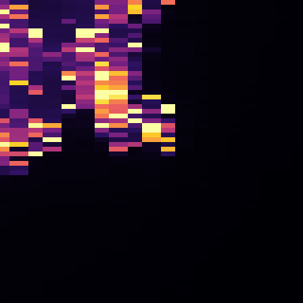
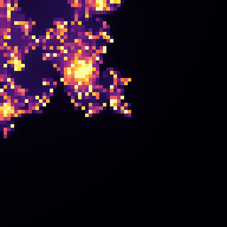

# High-precision experiment: `⎕FR←1287`

**Date:** 2 August 2026 · **Endpoint:** `https://tryapl.org/Exec` · **Raw data:** [`data/precision-experiment-raw.jsonl`](data/precision-experiment-raw.jsonl)

## Recommendation

**Keep standard precision as the only public mode. Do not add a Precision control.**

Decimal128 works, and at sufficient depth it is visibly, unambiguously better —
the two images below are the same coordinates and the same code, differing only
in `⎕FR`. That is not the question. The question is whether anyone using the
application could reach that benefit, and they could not: the view that shows it
needs **600 iterations** where the control offers 60, a centre typed to **18
significant digits** where the control steps in thousandths, and a span of
**1×10⁻¹⁵** where the control stops at 0.002. All three, together, and then it
runs only at 64×64 — a quarter of the preset's own resolution — in eleven
seconds.

Within the settings the interface can actually produce, decimal128 changes
nothing at all. At 60 iterations every view tested, at every depth, is uniform
under both precisions: the artwork is one flat colour either way, and high
precision makes it one flat colour six times more slowly.

An advanced "deep zoom precision" toggle was considered and rejected on the same
evidence. On its own it would be a control that costs six times the wait and
changes no pixel, because the iteration ceiling — not the arithmetic — is what
makes those views flat. Making it useful would mean also raising the iteration
cap tenfold and giving the centre eighteen digits of precision, which is a much
larger change to the artwork's controls than the payoff justifies.

The finding is worth keeping. The code is editable, `⎕FR←1287` demonstrably
works, and the recipe is recorded below for anyone who wants to type it.

## What was measured, and what was found

| Question                                              | Finding                                                                                                                                                                                         |
| ----------------------------------------------------- | ----------------------------------------------------------------------------------------------------------------------------------------------------------------------------------------------- |
| Is `⎕FR←1287` accepted?                               | Yes. Reads back as `1287`, and `(0.1+0.2)-0.3` gives exactly `0` against `5.551115123E¯17` at the default.                                                                                      |
| Does it affect later expressions in the same request? | **Yes.** `⎕FR←1287 ⋄ x←0.1 ⋄ ⎕DR x` returns `1287`. Literals are converted when the line runs, not when it is tokenised, which is what makes a single-expression submission work at all.        |
| Response format and parsing                           | Unchanged. The count matrix is small integers whatever the arithmetic beneath it — `⎕DR` is `83` under both precisions — so the shape probe's type check and the matrix parser need no changes. |
| Compatible with banded rendering?                     | **Yes**, up to 112×112. Above that the workspace runs out.                                                                                                                                      |
| Maximum unbanded resolution                           | 90×90 at both precisions — this limit is the 93-line response cap, not the arithmetic.                                                                                                          |
| Maximum banded resolution                             | 160×160 standard, **112×112** high precision, at 28 iterations.                                                                                                                                 |
| Workspace failures                                    | None at standard precision. At high precision everything above 112² banded, and everything above 64² at the iteration counts deep views need.                                                   |
| Execution time                                        | **6× slower** at 60 iterations, **30–50× slower** at 600.                                                                                                                                       |
| Deep-zoom stability                                   | Genuinely better, and only past the point where binary64 coordinates collapse.                                                                                                                  |

## Where binary64 actually fails

Computed directly rather than assumed. For a 64-wide axis around x = ¯0.746:

| Span    | Distinct coordinates at `⎕FR←645` | At `⎕FR←1287` |
| ------- | --------------------------------- | ------------- |
| 1×10⁻¹³ | 64 of 64                          | 64 of 64      |
| 1×10⁻¹⁴ | 64 of 64                          | 64 of 64      |
| 1×10⁻¹⁵ | **1 of 64**                       | 64 of 64      |

At a span of 1×10⁻¹⁵ the pixel spacing falls below the spacing of the numbers
themselves, so every column of the axis rounds to the same double and the
artwork becomes horizontal streaks of repeated data.

## The one view where it matters

Finding it took two attempts, and the first attempt is worth recording because
it is the easy mistake. Picking a promising-looking centre and zooming in lands
inside the set: every point reaches the iteration limit, both precisions
correctly return one flat value, and the comparison measures nothing. The centre
has to be re-chosen at each depth to stay on the boundary — at every step,
re-centre on a pixel whose neighbours disagree.

**Centre:** ¯0.746450000000068004, 0.112000000000001473 · **Span:** 1×10⁻¹⁵ ·
**Resolution:** 64×64 · **Iterations:** 600

|                         | Distinct values | Duplicate columns (of 63) | Time   |
| ----------------------- | --------------- | ------------------------- | ------ |
| `⎕FR←645` (binary64)    | 156             | **45**                    | 0.2 s  |
| `⎕FR←1287` (decimal128) | **263**         | **0**                     | 11.0 s |

1,454 of 4,096 cells differ, and the first difference is 374 against 469 — far
too large to be rounding. Forty-five of sixty-three adjacent column pairs are
_identical_ under binary64, which is the collapse showing up in the picture.

| Binary64 — streaked                                           | Decimal128 — resolved                                                  |
| ------------------------------------------------------------- | ---------------------------------------------------------------------- |
|  |  |

Same coordinates, same code, same palette. The horizontal smearing on the left
is adjacent columns holding literally the same number.

## Where it does not matter

| View     | Span    | Iterations | Differing cells | Duplicate columns, 645 → 1287 | Reading                                                              |
| -------- | ------- | ---------- | --------------- | ----------------------------- | -------------------------------------------------------------------- |
| Wide     | 1.4     | 28–60      | 0–1 of 4,096    | 0 → 0                         | Agreement, as it should be                                           |
| Boundary | 0.05    | 28–60      | 0               | 0 → 0                         | No benefit                                                           |
| Deep     | 1×10⁻¹³ | 600        | 892             | 0 → 0                         | Both resolve it; the differences are chaotic sensitivity, not detail |
| Deeper   | 1×10⁻¹⁴ | 600        | 923             | 0 → 0                         | Same                                                                 |
| Deepest  | 1×10⁻¹⁵ | 600        | 1,454           | **45 → 0**                    | The only genuine improvement                                         |

The distinction the middle rows make is the important one. At 1×10⁻¹³ and
1×10⁻¹⁴ the two precisions disagree about roughly a fifth of the cells, which
looks impressive and means nothing: both have zero duplicate columns and
near-identical distinct counts (300 against 299, 270 against 269). Six hundred
iterations of a chaotic map amplify a difference in the sixteenth digit into a
difference of one or two in the count. That is not extra detail; it is the same
picture computed two ways. Only at 1×10⁻¹⁵, where the duplicate-column count
goes from 45 to 0, does the structure itself change.

## At the iteration ceiling the interface offers

This is what settles it.

| Span    | Iterations | `⎕FR←645`        | `⎕FR←1287`       | Differing |
| ------- | ---------- | ---------------- | ---------------- | --------- |
| 1×10⁻¹³ | 60         | 1 distinct value | 1 distinct value | 0         |
| 1×10⁻¹⁴ | 60         | 1 distinct value | 1 distinct value | 0         |
| 1×10⁻¹⁵ | 60         | 1 distinct value | 1 distinct value | 0         |

Every deep view is a single flat colour at 60 iterations, at both precisions,
because at that depth nearly every point is still inside the set after 60 steps.
Precision cannot help with that — it is the iteration count that is short, and
the existing "every point in this view reached the current iteration limit"
message already says so.

## What a usable configuration would have to be

| Resolution | Iterations | Transport | Outcome             |
| ---------- | ---------- | --------- | ------------------- |
| 64×64      | 600        | direct    | **ok, 10.9 s**      |
| 90×90      | 600        | direct    | failed              |
| 112×112    | 600        | banded    | failed after 11.5 s |
| 128×128    | 600        | banded    | failed immediately  |

Sixty-four square is the only size that completes. The preset's default is
128×128 and its maximum 144×144, so high precision at a useful depth costs three
quarters of the artwork's resolution as well as fifty times its runtime.

## Limitations

- One client, one location, one afternoon, against a shared public service whose
  load nobody controls. The timings are the same kind of evidence as the
  [algorithm benchmark](mandelbrot-benchmark.md) and carry the same caveats.
- Failures above 64×64 at 600 iterations are reported as `aplError` and could be
  the workspace, an execution time limit at the service, or both. From outside
  there is no way to tell them apart, and for this decision it does not matter:
  either way the run does not complete.
- The centre used here was found with binary64 arithmetic, which is exactly the
  precision under test. It is good enough to place a boundary point at this
  depth — the search only needs the _neighbourhood_ to be right — but a study
  going deeper would need arbitrary precision to choose its coordinates.
- No claim is made about depths beyond 1×10⁻¹⁵.

## Exact code

Standard precision is the preset as it ships. High precision is the same source
with one line in front:

```apl
⎕FR←1287
⍝ Controls
size←64
iterations←600
centreX←¯0.746450000000068004
centreY←0.112000000000001473
zoom←1E¯15

⍝ The patch of the plane to look at, as two real matrices.
⍝ TryAPL does not support complex numbers, so the real and imaginary
⍝ parts are carried separately.
ax←centreX+zoomׯ1+2×(¯1+⍳size)÷size-1
ay←centreY+zoomׯ1+2×(¯1+⍳size)÷size-1
cr←(size,size)⍴ax
ci←⍉(size,size)⍴ay

⍝ Repeat z←z²+c, counting the steps each point survives. `a` marks the
⍝ points that have not escaped; once one has, it can never count again.
step←{(zr zi a n)←⍵ ⋄ a←a∧4>(zr*2)+zi*2 ⋄ (¯9⌈9⌊cr+(zr*2)-zi*2)(¯9⌈9⌊ci+2×zr×zi)a(n+a)}
⊃⌽step⍣iterations⊢(cr×0)(ci×0)((size,size)⍴1)(cr×0)
```

Paste that into the editor and press Run. It takes about eleven seconds and it
is the only configuration in this report where high precision earns its cost.
Note that the iteration and span values are outside what the sliders offer, so
moving any slider afterwards will overwrite them.

## Reproducing

```
npx tsx scripts/experiment-precision.ts        # the grid, ceilings, banding
npx tsx scripts/experiment-precision-deep.ts   # the deep boundary comparison
npx tsx scripts/capture-precision-images.ts    # the two images above
```

Nothing in the application imports any of them, and the production preset is
unchanged.
